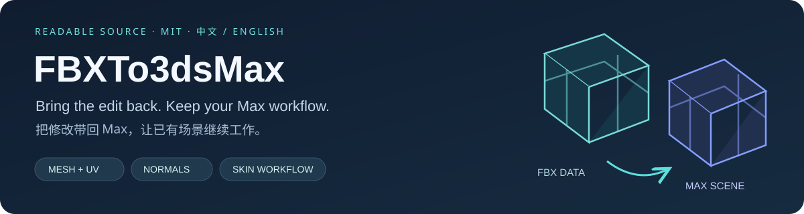
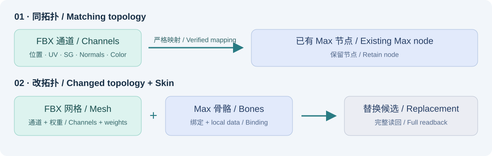
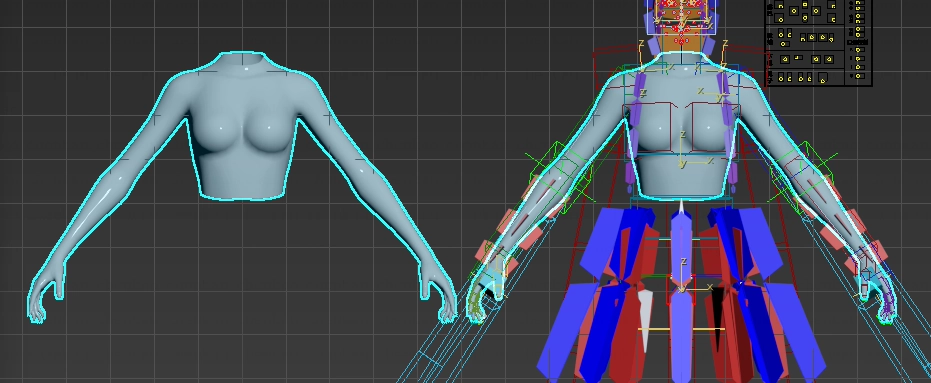
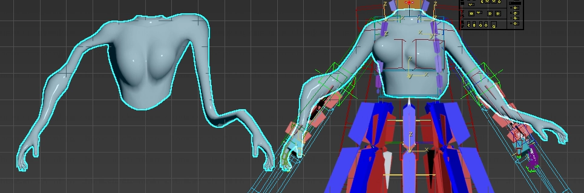

# FBXTo3dsMax

**把 FBX 的修改带回已有的 3ds Max 场景。** 由 Dimmens 开发，免费开放可读 Python / MAXScript 源码。

[English](docs/en/README.md) · [中文完整说明](docs/zh/README_中文.md) · [安装](docs/zh/INSTALL_中文.md) · [使用教程](docs/zh/FBXTo3dsMax_详细说明书.md) · [MIT](LICENSE)

**版本：1.4.24** · 界面支持 **中文 / English**。本轮完成298项纯回归、32项安装资源检查与 Max 2023.3.10 本地宿主验证，涵盖安装、自检、双语界面、回滚和卸载。结果与边界见[测试说明](docs/TESTING.md)。

## 选对工作流

| 你修改了什么 | 模式 | 结果 |
|---|---|---|
| 拓扑保持一致，只改形状或通道 | **模型完全一致 / 传递数据** | 保留选中的 Max 节点，传入勾选的数据 |
| FBX 拓扑改变，双方网格都有 Skin | **模型不一致 / 替换并保留蒙皮** | 用 FBX 网格替换，保留 Max 场景骨骼与绑定系统，采用 FBX 权重 |

模式一支持点位置、UV 1–3、光滑组、自定义法线、RGB 顶点色、Alpha、材质与逐面 ID。相同点数、面数并不足够，插件还验证顶点身份、边连接和面角绕序。

模式二默认保留 FBX 的网格、通道、法线和材质。旧网格默认隐藏备份；它不复制旧节点的父子层级、变换/动画控制器或任意修改器栈。完整条件与回滚边界见[使用教程](docs/zh/FBXTo3dsMax_详细说明书.md)。

## 五步开始

1. 在[仓库](https://github.com/DimmensCK/FBXTo3dsMax)选择 **Code → Download ZIP**，解压完整工程并保持目录结构。
2. 打开 Max，将根目录 **`Install_FBXTo3dsMax.ms`** 拖入视口，确认安装成功。
3. 点击顶部 **FBX 转 MAX / FBX to MAX**；用 **语言 / Language** 选择中文或 English。
4. 运行插件自检，阅读报告；第一次传递使用**场景副本**。
5. 选择 Max 接收网格、FBX、模式与通道，先 **检查 FBX/匹配 / Check FBX / Match**，再 **开始执行 / Run Transfer**。

正常安装使用 Max 自带 Python，无需另装 Python、编译器或管理员权限。不要只下载单个安装脚本。重复安装、归档和卸载见[安装说明](docs/zh/INSTALL_中文.md)。

## 看看形状传递

| 传递前 / Before | 传递后 / After |
|---|---|
|  |  |

以上为作者授权的历史功能示意，不是 1.4.24 的验收录像；不附带场景或模型文件。[媒体说明](docs/assets/MEDIA.md)

[观看历史演示：变形结果与绑定检查（v1.3.23，约 10 秒）](docs/assets/demos/mode1-deformation-v1.3.23.mp4)。画面仅展示结果检查，完整步骤按教程操作；它不证明新版或整个传递流程通过。

## 环境与边界

本轮实测为 **Windows 11 x64、Max 2023.3.10、内置 Python 3.9.7**。XML 声明 Max 2023–2026，**2024–2026 尚未验证**；旧27项版本升级到32项的流程未单独测试。

模式一逐对象事务处理；后续对象失败不会自动撤销之前成功的对象。模式二保留旧网格时支持批次回滚；关闭备份后删除旧网格存在不可逆边界。自检使用原创小型程序样本，不能证明所有复杂资产、性能或未知缺陷都已覆盖。

运行报告写入 `%LOCALAPPDATA%\FBXTo3dsMax`；安装备份写入 `%APPDATA%\Autodesk\FBXTo3dsMaxInstaller`。仓库不包含 FBX、MAX 或 BLEND 模型文件。

## 继续阅读

- [中文教程](docs/zh/FBXTo3dsMax_详细说明书.md) / [English user guide](docs/en/USER_GUIDE.md)
- [安装与卸载](docs/zh/INSTALL_中文.md) / [Installation](docs/en/INSTALL.md)
- [测试范围](docs/TESTING.md) · [更新日志](docs/development/CHANGELOG_中文.md)
- [贡献](docs/development/CONTRIBUTING.md) · [GitHub 下载与维护](docs/GITHUB_发布指南.md)

Copyright © 2026 Dimmens · [MIT License](LICENSE)。可免费使用、修改、再分发和商用，须保留版权与许可证。许可不包含私有模型；Autodesk 3ds Max 需另行取得。
