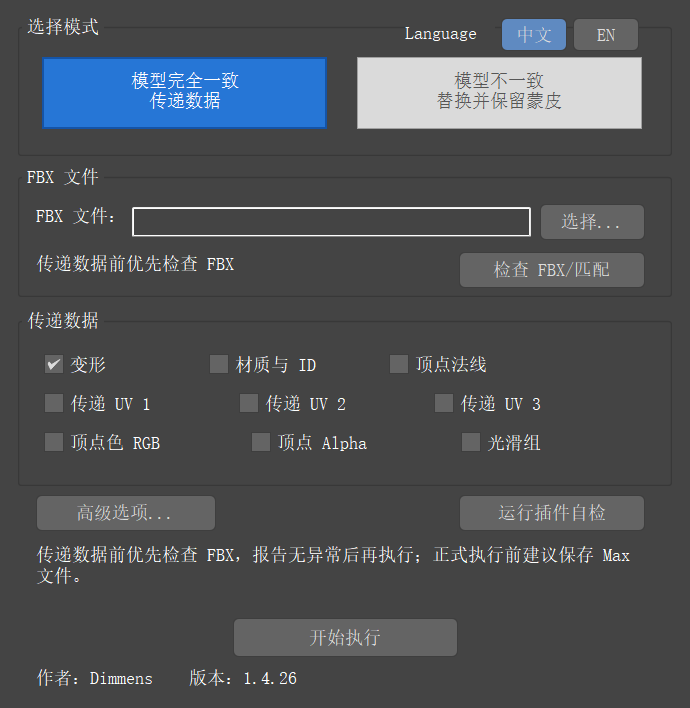
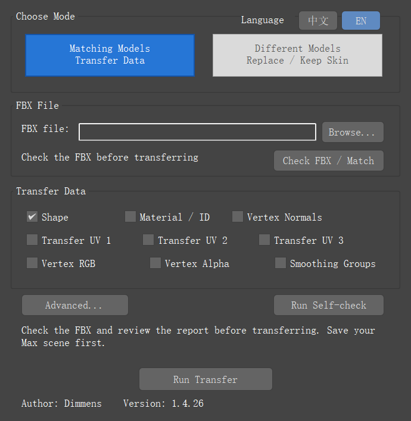
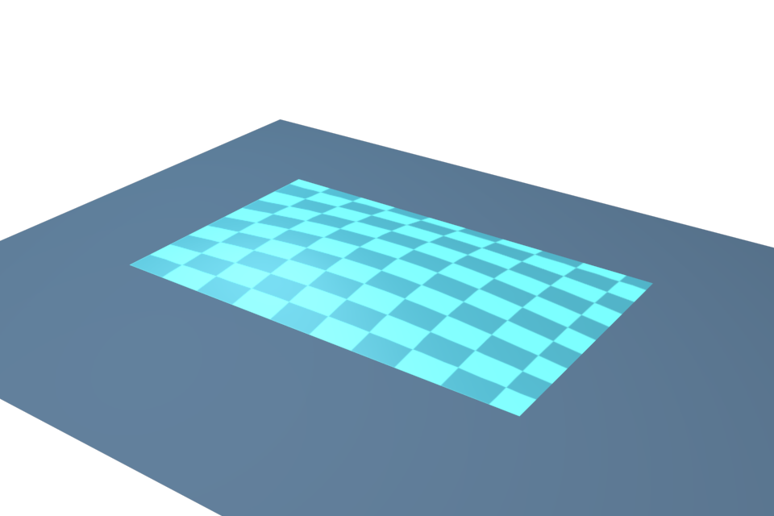
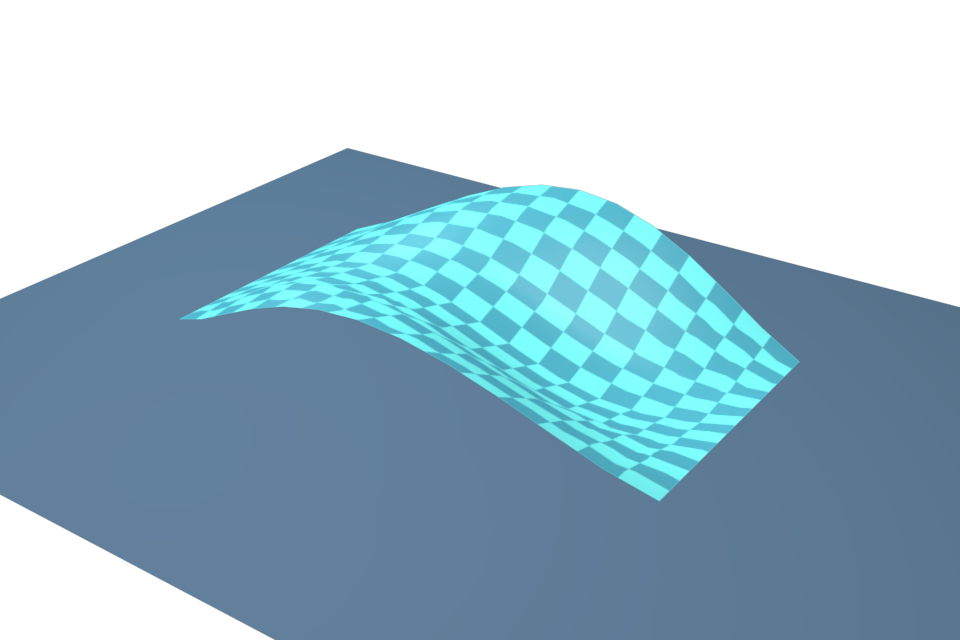
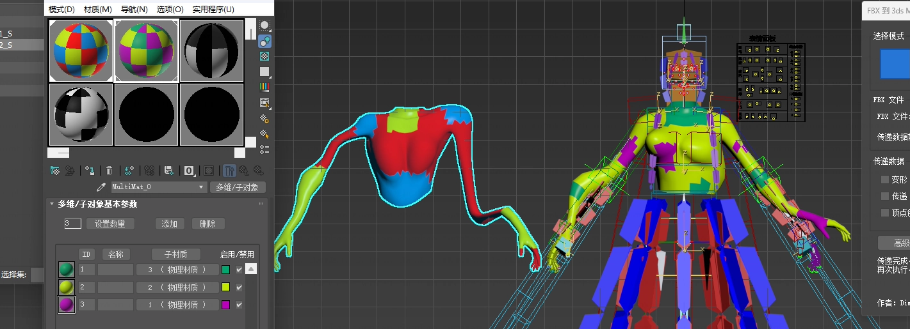
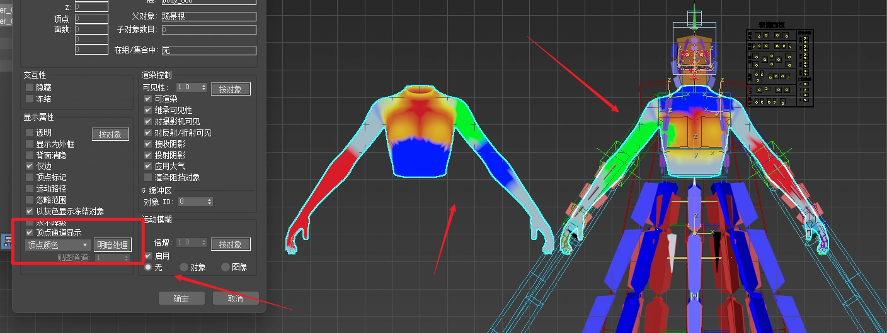
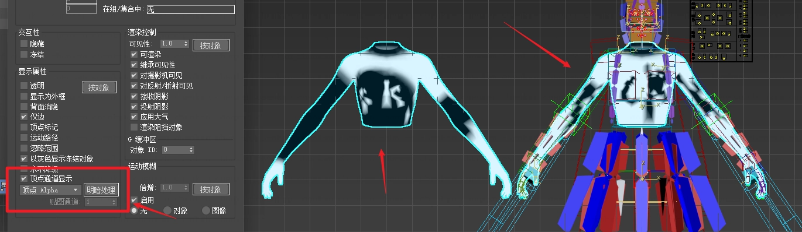
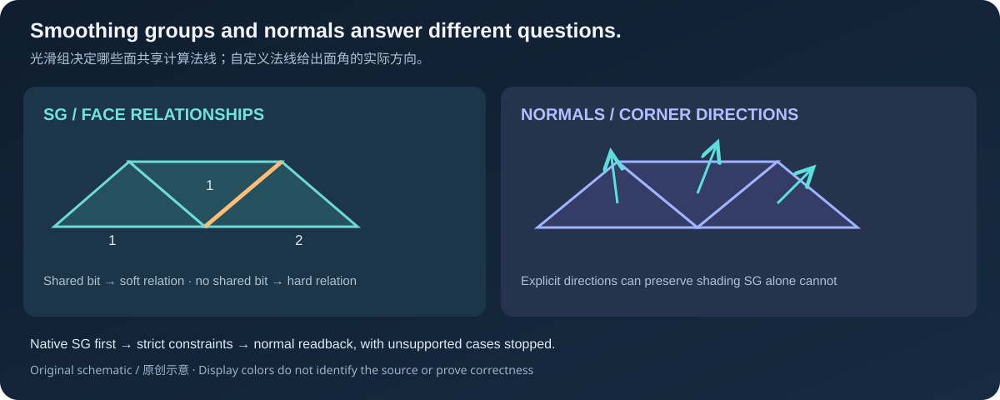
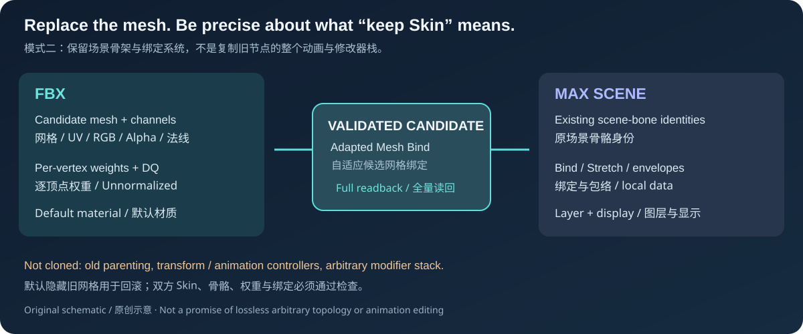

# FBXTo3dsMax

### 在别处修改模型，回到 Max 继续工作。

将 FBX 的形状、UV、材质、顶点色与法线带回已有 **3ds Max** 场景。拓扑不变时按通道更新；拓扑改变时，在 Skin、骨骼与绑定检查通过后替换网格。

**Dimmens · 免费可读源码 · MIT · 中文 / English**

**[下载 v1.4.26 完整源码](https://github.com/DimmensCK/FBXTo3dsMax/archive/refs/tags/v1.4.26.zip)** · [发行说明](https://github.com/DimmensCK/FBXTo3dsMax/releases/tag/v1.4.26) · [安装指南](docs/zh/INSTALL_中文.md) · [English](docs/en/README.md) · [中文快速概览](docs/zh/README_中文.md)

[三步开始](#quick-start) · [真实界面](#language-ui) · [选择模式](#workflows) · [传递效果](#examples) · [任务教程](#guides) · [测试与边界](#scope)

## 三步开始

1. **完整下载并解压。** 保留安装器、`contents/` 和其余目录，不要只下载单个脚本，也不要在 ZIP 内运行。
2. **拖入安装器，确认成功。** 保存场景，将根目录 **`Install_FBXTo3dsMax.ms`** 拖入 Max 视口。安装失败先解决，不继续使用。
3. **打开、自检、试副本。** 点击顶部 **FBX 转 MAX / FBX to MAX**，选 **中文 / EN**，运行自检；首次从场景副本、单对象和界面默认勾选的“变形”开始。

插件使用 Max 自带 Python，通常不需要额外解释器、编译器或管理员权限。卸载入口为根目录 `Uninstall_FBXTo3dsMax.ms`。[安装、重装与卸载的详细步骤 →](docs/zh/INSTALL_中文.md)

各版本真实宿主、自检结果与限制以[测试说明](docs/TESTING.md)为准。包描述声明 Max 2023–2026；**2024–2026 尚未实测**。

## 中文与 English，直接切换

**Language · 中文 / EN** 位于模式标题右侧。原位切换保留模式、FBX、选项与检查状态，两个按钮保持单选。

| 中文界面 | English UI |
|---|---|
|  |  |
| [查看中文原图](docs/assets/ui/rollout-1.4.26-cn.png) | [Open English image at full size](docs/assets/ui/rollout-1.4.26-en.png) |

上图为 **1.4.26 在 3ds Max 2023.3.10 中的历史真实界面参考**，使用未裁剪的原始 PNG。两张布局图来自较早源码，不代替下方新核心修订的验收。点击右上角中文 / EN 可原位切换，保留当前模式、文件、选项与检查状态；再次点击当前语言仍保持唯一选中。已知界面与报告标签支持中英切换，技术诊断保留原文。

These original, uncropped PNGs show an **earlier source revision of 1.4.26 running in 3ds Max 2023.3.10**. They document the layout and do not qualify the revised core below. The compact 中文 / EN buttons switch in place while retaining the mode, file, options and check state. One language stays selected, including when its active button is clicked. Known UI/report labels are translated; technical diagnostics retain their original text.

[English overview →](docs/en/README.md#language-ui)

## 选对工作流，更新需要的数据

数据方向始终是 **FBX 提供数据 → Max 接收网格**。

| 你的任务 | 选择 | 保留与前提 |
|---|---|---|
| 调形状、重做 UV、更新材质/逐面 ID、RGB/Alpha 或法线 | **模式一 · 模型完全一致 / 传递数据** | 保留 Max 接收节点，按勾选通道写入。顶点身份、连接、绕序和面映射须能唯一对应；相同点/面数并不够 |
| 拓扑改变，结合 FBX 新网格/权重与 Max 场景骨骼 | **模式二 · 模型不一致 / 替换并保留蒙皮** | 双方各有一个合格 Skin，骨骼、权重和绑定验证通过。默认隐藏旧网格备份 |

模式二不复制旧节点的父子层级、Transform/动画控制器、约束或任意修改器；FBX 提供逐顶点权重，Max 提供场景骨骼与绑定系统。多对象替换必须保留备份。[完整条件与失败边界 →](docs/zh/FBXTo3dsMax_详细说明书.md#任务五拓扑改变后替换带-skin-的网格)

## 看清修改带回了什么

试做[原创雨棚练习](https://github.com/DimmensCK/FBXTo3dsMax/blob/main/docs/examples/README.md)：现场生成接收网格和编辑后的 FBX，先检查，再传递变形与 UV 1，并核对结果。无需下载模型。生成器只准备场景，不代替插件执行；实机覆盖以 TESTING 为准。

| 原创雨棚：传递前 / Before | 传递后 / After |
|---|---|
|  |  |

这组原图来自本次新源码在 **Max 2023.3.10** 中的同一次真实插件执行：公开生成器创建 **91 顶点、144 三角形**的原创雨棚，预检后实际传递变形与 UV1，保留接收节点、材质和选择。两幅 **960×640** 原生 scanline 渲染采用同一相机、棋盘材质与灯光，分别显示原始低起伏雨棚与传递后的明显波浪及 UV 变化。安装副本运行已自然退出 0，并完成独立复核；它们不是界面截图或物理鼠标操作记录。

These original images come from the same actual plugin run on the new source in **Max 2023.3.10**. The public generator authored an original **91-vertex, 144-triangle** canopy; real preflight and Shape/UV1 transfer retained the receiver, material and selection. Both **960×640** native scanline renders use the same camera, checker material and lighting. The installed run exited naturally 0 and passed independent review. These are not UI captures or physical-mouse records.

本次源码修订处理模式一形状回传中的重复变换：源节点含单位缩放，或源/目标矩阵不同时，不应再次变换已处于世界空间的求值点。原创雨棚练习同时修正了 UV 构建、FBX 文本布局与失败时的自有节点清理。新安装副本已实际完成 16 例独立世界点回归，并由真实旧 MXS 点位 helper 负例检出已知重复变换错误。原生用例、安装副本运行及安装生命周期均已完成实际验收与独立复核。

This source revision removes a repeated transform during Mode 1 shape transfer when unit scale or differing node transforms are involved. The original canopy generator also repairs UV construction, FBX text layout and owned-node cleanup on failure. The new installed copy completed all 16 independent world-coordinate cases and rejected the actual legacy MXS point helper for the known repeated-transform error. The installed run and installation lifecycle completed their natural-exit, log and origin checks and independent review.

实际覆盖与日期见[测试说明](docs/TESTING.md)及[Release](https://github.com/DimmensCK/FBXTo3dsMax/releases/tag/v1.4.26)。 / See [Testing](docs/TESTING.md) and the [Release](https://github.com/DimmensCK/FBXTo3dsMax/releases/tag/v1.4.26) for executed scope and dates.

### 形状更新，继续使用原 Max 节点

| 授权历史示意：传递前 | 授权历史示意：传递后 |
|---|---|
|  |  |
| [查看原图](docs/assets/tutorial/deformation-before.webp) | [查看原图](docs/assets/tutorial/deformation-after.webp) |

模式一只勾“变形”可更新点位置；这次不改的通道保持未勾选。历史图展示功能效果，左右位置不定义谁提供数据。[约10秒历史结果检查视频 · v1.3.23](docs/assets/demos/mode1-deformation-v1.3.23.mp4) · [照步骤操作](docs/zh/FBXTo3dsMax_详细说明书.md#任务一只修改形状)

### 通道分开选择，避免不必要的覆盖

| 想更新什么 | 对应选项 | 核对重点 |
|---|---|---|
| UV | UV 1 / 2 / 3 | 对应 map channel 1 / 2 / 3 与面角映射；只选择实际存在的通道 |
| 材质与面分配 | 材质与 ID | 材质对象与每个面的 ID 一起核对 |
| 顶点色与遮罩 | RGB、Alpha 分别勾选 | RGB 是通道0，独立 Alpha 是通道-2，不由亮度猜测 |
| 平滑关系与方向 | 光滑组、顶点法线 | SG 决定面之间的共享关系；法线指定面角方向 |

展开授权历史画廊：材质 / RGB / Alpha

**材质与逐面 ID**：查看实际面分配，不只看视口颜色。

[查看原图](docs/assets/tutorial/materials-and-face-ids.webp)

**RGB 与独立 Alpha**：两个通道分别检查。

[RGB原图](docs/assets/tutorial/vertex-color-rgb.webp)

[Alpha原图](docs/assets/tutorial/vertex-alpha.webp)

历史截图和视频已获作者授权，不随附底层模型；原创 SVG 用于解释概念。界面参考、历史结果和概念示意分别标注。[媒体来源与范围](docs/assets/MEDIA.md)

## 为什么适合模型迭代

| 能力 | 工作中的意义 |
|---|---|
| **选择性通道更新** | 例如只传 UV，不替换材质；界面默认只勾“变形” |
| **面角与面映射** | UV/法线按面角，材质ID/SG按面处理，不将这些数据混为一谈 |
| **光滑与法线分工** | 优先有效 FBX 原生平滑层；推导约束不能严格满足时停止，避免悄悄近似 |
| **Skin 来源明确** | Max 场景骨骼/绑定与 FBX 权重各负其责，提交前后读回检查 |
| **可检查的执行过程** | 预检、写入、读回和恢复都有报告；预检通过不等于传递已经完成 |
| **可读源码与 MIT** | Python / MAXScript 直接阅读、修改和再分发，保留版权与许可证 |

界面默认只勾选“变形”，UV 1 / 2 / 3 默认未勾选。直接调用 Python API 时，`TransferOptions` 的 `transfer_uv=True`、`uv_channels=[1]` 是另一组默认值；脚本调用应显式设置需要的通道。

The UI initially selects Shape only. The Python API separately defaults to `transfer_uv=True` and `uv_channels=[1]`; set intended channels explicitly in scripts.

进一步了解光滑组、法线与Skin数据来源

SG 与自定义方向解决不同问题。插件保留的 `F2M_顶点法线` 是结果的一部分，不应删除或塌陷；用户的 Edit Normals / Weighted Normal 不会被静默清除。

新网格、通道和权重来自 FBX；Max 提供场景骨骼身份、绑定 local data 和包络，候选 Mesh Bind 自适应建立。它不承诺任意拓扑编辑后复制完整旧动画系统。

## 按任务继续阅读

| 任务 | 中文 | English |
|---|---|---|
| 安装、重复安装、卸载 | [安装指南](docs/zh/INSTALL_中文.md) | [Install](docs/en/INSTALL.md) |
| 形状更新 | [任务一](docs/zh/FBXTo3dsMax_详细说明书.md#任务一只修改形状) | [Shape](docs/en/USER_GUIDE.md#task-1--update-shape-only) |
| UV、材质与面 ID | [任务二](docs/zh/FBXTo3dsMax_详细说明书.md#任务二更新-uv材质与面-id) | [UV / materials](docs/en/USER_GUIDE.md#task-2--update-uvs-materials-and-face-ids) |
| RGB 与 Alpha | [任务三](docs/zh/FBXTo3dsMax_详细说明书.md#任务三分别传递-rgb-与-alpha) | [Vertex data](docs/en/USER_GUIDE.md#task-3--transfer-rgb-and-alpha-separately) |
| 光滑组与法线 | [任务四](docs/zh/FBXTo3dsMax_详细说明书.md#任务四选择光滑组或自定义法线) | [Normals](docs/en/USER_GUIDE.md#task-4--choose-smoothing-groups-or-custom-normals) |
| 拓扑改变后的 Skin 替换 | [任务五](docs/zh/FBXTo3dsMax_详细说明书.md#任务五拓扑改变后替换带-skin-的网格) | [Skin workflow](docs/en/USER_GUIDE.md#task-5--replace-a-skinned-mesh-after-topology-changes) |
| 数据合同、算法与事务 | [完整参考](docs/zh/FBXTo3dsMax_详细说明书.md#技术参考) | [Technical reference](docs/en/USER_GUIDE.md#technical-reference) |

## 执行结果与使用范围

1.4.26 在 **Windows 11 x64、3ds Max 2023.3.10** 完成 **337/337** 纯回归、**32 项**静态资源检查，以及全新/重复安装、冷启动、中文六类自检、九个故障场景、16 例独立世界坐标回归与原创演示。真实安装失败回滚、正常重试和可恢复卸载通过，归档字节已核对，**归档复装未演练**。各项实际执行及独立复核范围见[测试说明](docs/TESTING.md)；Max 2024–2026 尚未实测。

本轮未扩大重跑完整双语链、附加英文自检或 PowerShell 三阶段；较早结果仅作对应来源的历史记录。当前界面实证是新安装与冷启动的程序检查，详细范围见 TESTING。

**以下为报告状态示例：**

| 报告表达的状态 | 应怎样处理 |
|---|---|
| 检查通过 | 可以继续正式执行，尚未传递完成 |
| 所选 UV 通道缺失并跳过 | 该通道没有复制；需要它时先修正 FBX |
| 执行完成 | 核对这次选择的通道、外观、动画与保存重载 |
| 失败 / 回滚不完整 | 保留副本和报告，先解决问题，不扩大批量操作 |

模式一以逐对象事务执行，后续对象失败不会自动撤销先前成功的对象。模式二保留旧网格时支持批次回滚；单对象关闭备份后存在不可逆删除边界。正式传递同步执行，没有中途安全取消。

[TESTING](docs/TESTING.md)记录对应版本的真实环境和覆盖范围。这些小型原创测试未覆盖所有复杂资产和故障，仍可能有未知缺陷；归档字节完整也不等于已经演练归档复装。

报告在 `%LOCALAPPDATA%\FBXTo3dsMax`，安装日志/备份在 `%APPDATA%\Autodesk\FBXTo3dsMaxInstaller`。公开反馈前去掉本机路径、模型名与项目资料。[Issues](https://github.com/DimmensCK/FBXTo3dsMax/issues) · [贡献说明](docs/development/CONTRIBUTING.md) · [更新日志](docs/development/CHANGELOG_中文.md)

## 开源与维护

本仓库提供源码、教程与授权媒体，**不分发私有 FBX / MAX / BLEND 模型、原 PDF 或内部链接**。主分支 [main ZIP](https://github.com/DimmensCK/FBXTo3dsMax/archive/refs/heads/main.zip) 是开发快照；首次安装优先使用上面的固定发行版。[GitHub下载与维护指南](docs/GITHUB_发布指南.md)

如果对你的工作有帮助，欢迎 Star，方便以后找到项目。

Copyright © 2026 **Dimmens** · [MIT License](LICENSE)。免费使用、修改、再分发及商用，须保留版权与许可证。教程媒体授权不授予底层私有模型使用权。Autodesk 3ds Max 需另行取得。
